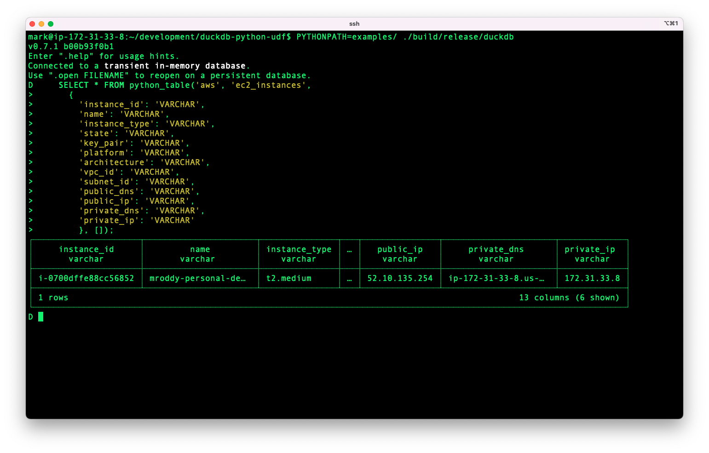
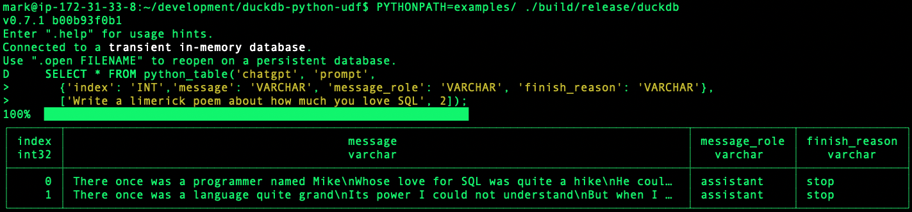
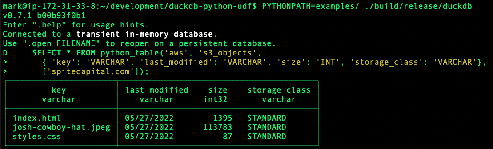

A DuckDB extension for using Python based functions in SQL queries.

Note you don't *need* to write your own python functions. This extension will also work with any importable function, both from the standard library as well as installed 3rd party modules. 

# Table Functions
The `pytable` table function lets you use the output of a python function as the FROM clause in a SQL query. This lets you trivially wire in new data sources, including external ones, to be queried using SQL, joined to other data sources, etc.

## Table Function Example
As an example, here is a Python function that uses the PyGithub library to enumerate Git Repos for a user:
```python
from github import Github

token = os.environ["GITHUB_ACCESS_TOKEN"]
g = Github(token)

def repos_for(username):
    for r in g.get_user(username).get_repos():
        yield (r.name, r.description, r.language)
```

Using the `pytable` function in a SQL query, you can call this Python function and query its output.
```sql
> SELECT *
  FROM pytable('ghub:repos_for', 'markroddy',
                    columns = {'repo': 'VARCHAR', 'description': 'VARCHAR', 'language': 'VARCHAR'})
  WHERE repo like '%duck%';
┌─────────────────────────────┬────────────────────────────────────────────────────────────────┬────────────┐
│            repo             │                          description                           │  language  │
│           varchar           │                            varchar                             │  varchar   │
├─────────────────────────────┼────────────────────────────────────────────────────────────────┼────────────┤
│ dbt-duckdb                  │ dbt (http://getdbt.com) adapter for DuckDB (http://duckdb.org) │ Python     │
│ duckdb                      │ DuckDB is an in-process SQL OLAP Database Management System    │ C++        │
│ duckdb-python-udf           │                                                                │ C++        │
│ duckservability             │ Inspect Your Servers with DuckDB                               │ Shell      │
└─────────────────────────────┴────────────────────────────────────────────────────────────────┴────────────┘
```

## Function Arguments
The first argument must be a string with a value in the form of `'<module>:<function>'`. All other non-named arguments will be passed as an argument to the python function specified. For example:

```sql
SELECT *
FROM pytable('<module>:<function>', 'arg1', 2, 'arg3',
  columns = {'columnA': 'INT', 'columnB': 'VARCHAR'})
```
This will import the name `<module>`, reference the value named `<function>`. Note this value can be a function, or any other type that supports the [callable protocol](https://docs.python.org/3/library/functions.html#callable). The extension will then call `<function>`, passing in the values `'arg1'`, `2`, and `'arg3'`.


Please see the table below for a further breakdown of each of the named arguments.
| named argument | description |
| -------------- | ----------- |
| columns        | Required. A struct mapping column names to expected DuckDB data types.|
| kwargs         | Optional. A struct mapping named arguments to be passed to the python function. In python, this is passed as if you called `func(**kwargs)`. |

# Scalar Functions
The `pyfunc` scalar function lets you call a Python function and capture its output in the SELECT portion of a SQL query. 

## Scalar Function Example
Lets say you want to take a string and apply title casing it. There is already a builtin function Python named `capwords` in the `strings` module which can do this for us, so we don't even need to write a Python function.

```sql
> SELECT pyfunc('string:capwords', 'foo bar baz') as result;

┌─────────────┐
│   result    │
│   varchar   │
├─────────────┤
│ Foo Bar Baz │
└─────────────┘
```

Alternatively, lets say you need to write your own Python function. Let say you need a Fizzbuzz function you can call from SQL, because you're interviewing, and the company that's currently evaluating you is terrible. Here's the python function:
```python
def fizzbuzz(i):
    if (i%3) == 0 and (i%5) == 0:
        return 'FizzBuzz'
    elif (i%3) == 0:
        return 'Fizz'
    elif (i%5) == 0:
        return 'Buzz'
    else:
        return str(i)
```

You can call this function from within SQL:
```sql
> select pyfunc('udfs:fizzbuzz', 3) as result;
┌─────────┐
│ result  │
│ varchar │
├─────────┤
│ fizz    │
└─────────┘
> select pyfunc('udfs:fizzbuzz', 5) as result;
┌─────────┐
│ result  │
│ varchar │
├─────────┤
│ buzz    │
└─────────┘
> select pyfunc('udfs:fizzbuzz', 15) as result;
┌──────────┐
│  result  │
│ varchar  │
├──────────┤
│ fizzbuzz │
└──────────┘
> select pyfunc('udfs:fizzbuzz', 11) as result;
┌─────────┐
│ result  │
│ varchar │
├─────────┤
│ 11      │
└─────────┘
```

## Additional Examples and Use Cases
Since anything you can do in Python can now show up in DuckDB as a table, the world is your oyster here. In particular, it's trivial to make any external resource that has a python library associated with it show up as a database table. Some things you might want to try (all of which can be found in the [examples/ directory](examples/)). Note, be sure to include the relevant file from the `examples/` directory in your Python path or these won't work.

### Query your EC2 Instances


### Query ChatGPT


### Query S3 Bucket Objects
Note this queries the names of objects themselves, not their contents. This can be useful for combing through buckets that have massive amounts of objects in them.


# Current Limitations
Note these are not inherent limitations that can not be overcome, but presently have yet to be overcome. Feel free to help with that!

* Binaries only available for Linux x64 architecture. Builds for OSX and Windows coming soon.
* Scalar functions only support returning `VARCHAR` values at this time.
* Not all DuckDB and Python datatypes have been fully mapped. Please file an issue if you find one unsupported.

# Installation and Usage

First, [install DuckDB](https://duckdb.org/docs/installation/). Note that at present, a Bleeding Edge installion is required until DuckDB 0.7.2 is released.

Next, start the DuckDB shell using the 'unsigned' option. Note that depending on your choosen environment (commandline, Python, etc) the manner in which you specify this will vary. A few examples are provided in the next section below.

Run the following commands to install the extension and activate it:

```sql
SET custom_extension_repository='net.ednit.duckdb-extensions.s3.us-west-2.amazonaws.com/python_udf/latest';
INSTALL python_udf;
LOAD python_udf;
```

## Writing Python Functions for Use as Tables
Python functions can accept an arbitrary number of primitive data which can be invoked in a positional manner.

These functions must return an iterator (or use the 'yield' syntax). Each value in this iterator will represent
a single row in the database table. As such, the number of values in each row must be consistent across all rows,
and it must match the number of columns specified when the function is invoked from SQL. Additionally, the data
type for each value should be convertable to the column data type specified. If the conversion is not possible a
null value will be substituted.


## Setting the Unsigned Option
CLI:
```shell
duckdb -unsigned
```

Python:
```python
con = duckdb.connect(':memory:', config={'allow_unsigned_extensions' : 'true'})
```

NodeJS:
```js
db = new duckdb.Database(':memory:', {"allow_unsigned_extensions": "true"});
```
    

# Development
Clone the repo being sure to use the `recurse-submodules` option:

```sh
git clone --recurse-submodules git@github.com:MarkRoddy/duckdb-python-udf.git
```
Note that `--recurse-submodules` will ensure the correct version of duckdb is pulled allowing you to get started right away.

## Dependencies
Python3.9 development version. On a Ubuntu system, you can install these via:
```sh
sudo apt-get -y install python3.9-dev
```

## Building
To build the extension:
```sh
make
```
The main binaries that will be built are:
```sh
./build/release/duckdb
./build/release/test/unittest
./build/release/extension/python_udf/python_udf.duckdb_extension
```
- `duckdb` is the binary for the duckdb shell with the extension code automatically loaded. 
- `unittest` is the test runner of duckdb. Again, the extension is already linked into the binary.
- `python_udf/python_udf.duckdb_extension` is the loadable binary as it would be distributed.

## Running the extension
To run the extension code, simply start the shell with `./build/release/duckdb`.

Now we can use the features from the extension directly in DuckDB. Included in this extension is the ability to execute python functions. Bundled with this repository is a python file named 'udfs.py' that contains some example functions. You can invoke a function in this module by specifying the module name, the function name, and a single string argument to be passed to the function:
```
D select pyfunc('udfs:reverse', 'Jane') as result;
┌───────────────┐
│    result     │
│    varchar    │
├───────────────┤
│     enaJ      │
└───────────────┘
```

## Running the tests
Different tests can be created for DuckDB extensions. The primary way of testing DuckDB extensions should be the SQL tests in `./test/sql`. These SQL tests can be run using:
```sh
make test
```

